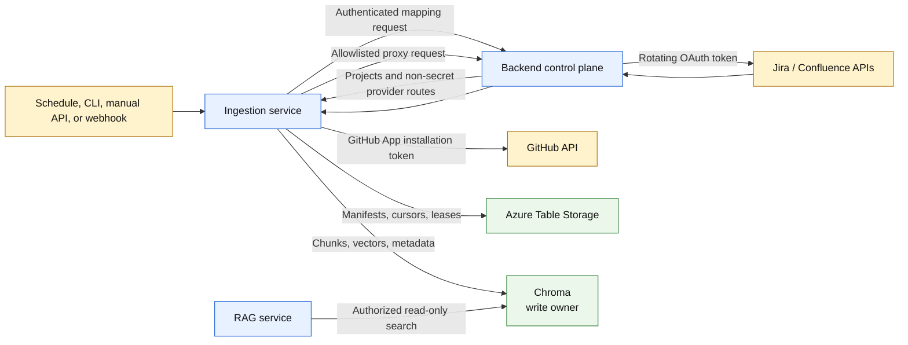
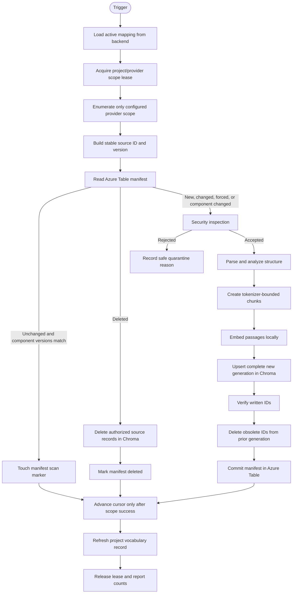
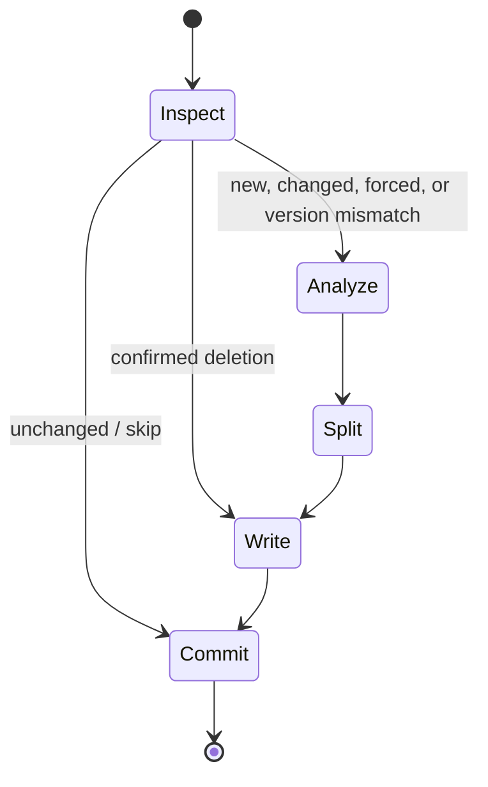
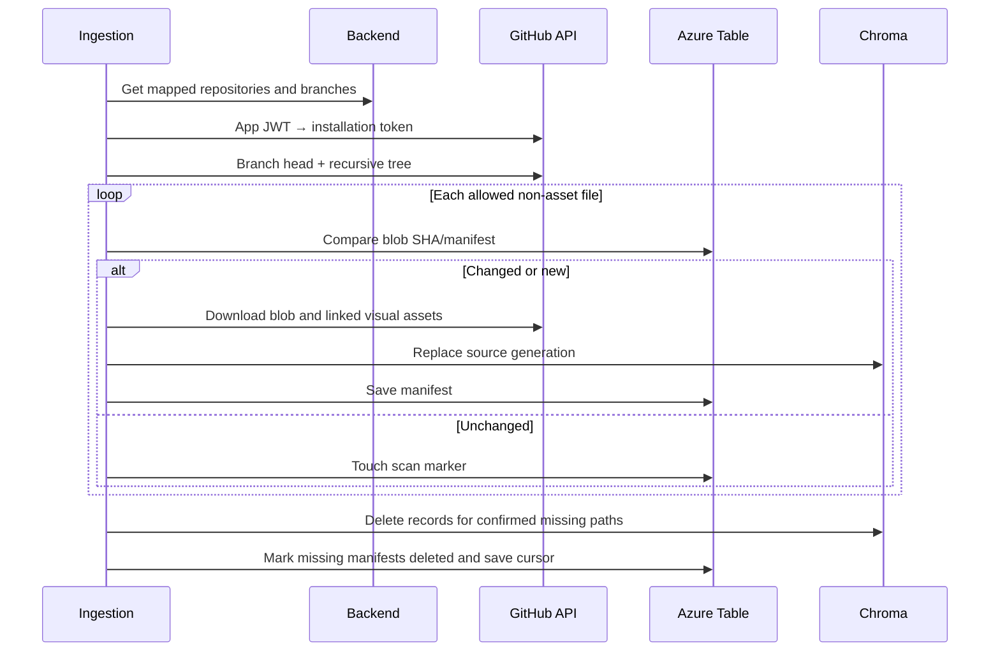
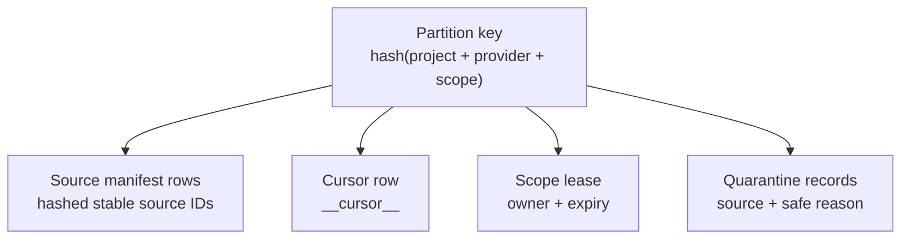
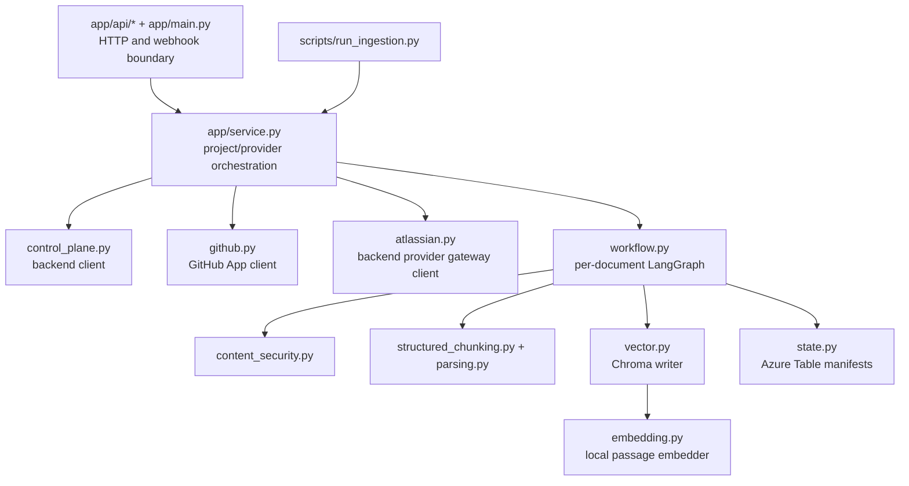

# Project Intelligence Ingestion — current architecture

Last verified against the repository code: 2026-08-31.

This is the single architecture reference for the ingestion project. It describes how GitHub,
Jira, Confluence, and supported attachments become secure, structured, project-isolated Chroma
records, and how Azure Table state makes the process incremental and retryable.

## 1. Purpose and boundary

Ingestion is the only writer to the retrieval corpus. It reads project-approved source systems,
normalizes documents, performs security and structure analysis, chunks content, creates embeddings,
writes Chroma, and commits operational state.

It owns:

- GitHub App source access and webhook verification;
- Jira and Confluence reads through the backend provider gateway;
- incremental source discovery and deletion reconciliation;
- content security, quarantine, parsing, and structure-aware chunking;
- passage embedding and Chroma upsert/delete operations;
- Azure Table manifests, cursors, leases, scan markers, and quarantine records;
- project vocabulary records derived from indexed metadata.

It does not own:

- end-user authentication or authorization;
- direct Azure SQL access;
- Atlassian refresh-token storage;
- chat history;
- online retrieval, reranking, or answer generation.

## 2. System context



The backend owns mappings and credentials. Ingestion owns source processing and vector writes. RAG
owns authorized reads.

## 3. Runtime entry points

| Entry point | Purpose |
|---|---|
| `python -m scripts.run_ingestion --project <id>` | Normal incremental project run |
| `python -m scripts.run_ingestion --project <id> --full` | Full reconciliation or controlled rebuild |
| `uvicorn app.main:app` | Health/readiness, protected manual triggers, GitHub webhook receiver |
| `python -m scripts.run_worker` | Queued worker with full binary/Docling dependencies |
| `scripts/run_unattended_ingestion.sh` | Local orchestration of dependencies and incremental providers |

The normal CLI path does not require a public ingestion port. The HTTP process is needed for
webhooks and remote/manual triggers.

## 4. Project configuration flow

Projects are not defined independently in the ingestion environment. For every run:

1. the trigger supplies a project ID and optional provider list;
2. ingestion authenticates to the backend internal API;
3. the backend loads the active SQL project record;
4. the backend returns validated GitHub/Jira/Confluence scopes, schedule information, logical
   Chroma route, schema version, embedding model, and Atlassian gateway metadata;
5. ingestion converts the payload into an `IngestionProject`;
6. processing stops if the project is missing, inactive, malformed, or lacks a required integration.

This prevents environment files, queue messages, or webhooks from inventing a project mapping.

## 5. End-to-end ingestion flow



The critical transaction rule is **Chroma first, manifest second**. A failed vector write cannot
advance the manifest or cursor, so the next run retries the source.

## 6. Per-document LangGraph

`DocumentIngestionWorkflow` runs one source document through a bounded state graph:



### Inspect

The workflow compares the source against its manifest using:

- stable source ID;
- provider version;
- normalized content hash;
- parser version;
- chunker version;
- embedding profile;
- schema version.

Any relevant component-version change intentionally causes reprocessing.

### Analyze

The security scanner inspects type, size, signatures, risky formats, embedded secrets, malware
requirements, and parsing policy. Accepted content is converted into a structured artifact. Parsing
is concurrency-limited and timeout-bounded.

### Split

The structured chunker chooses the format-specific strategy, preserves useful hierarchy and
locators, and produces stable `SourceChunk` values with separate evidence and embedding text.

### Write

The vector adapter embeds passages, upserts the full new source generation, verifies it, then
removes obsolete chunk IDs. Deletion uses a filter containing project, policy, provider, and source.

### Commit

Only after vector success does Azure Table store the new manifest or deletion marker. An unchanged
record is merely touched with the current scan marker.

## 7. Provider architecture

### GitHub

GitHub automation uses a GitHub App, not a personal access token.



Repository, branch, include/exclude patterns, and path limits come from the backend mapping. Blob
SHA is the primary version. Unchanged blobs are not downloaded, chunked, embedded, or rewritten.

The webhook endpoint verifies `X-Hub-Signature-256`, accepts only supported merged-PR events, and
uses the backend to resolve a repository to a project. Webhooks accelerate freshness; scheduled
reconciliation remains the correctness path.

### Jira

Jira data is requested through the backend Atlassian gateway:

1. ingestion receives the mapped Jira project key and cloud metadata;
2. JQL always includes the configured project key;
3. incremental JQL adds an update-time cursor with overlap;
4. issues are paginated in stable order;
5. issue fields, comments, and supported attachments become source documents;
6. update time and content hash prevent duplicate work;
7. the cursor advances only after the entire scope succeeds.

Incremental results cannot prove deletion, so Jira deletion reconciliation runs only during a
successful full scan.

### Confluence

Confluence is also read through the backend gateway:

1. ingestion enumerates pages in the mapped space;
2. optional root page IDs restrict the accepted page trees;
3. storage-format HTML is normalized while preserving headings, lists, and tables;
4. supported attachments become separate versioned sources;
5. page/attachment versions and hashes drive incremental work;
6. a successful full scan may reconcile deletions.

OAuth scopes never override Atlassian permissions. The integration account must itself be able to
read the selected project and space.

## 8. Parsing and chunking routes

| Content type | Processing strategy |
|---|---|
| PDF, scanned PDF, DOCX, PPTX, XLSX | Local Docling analysis and HybridChunker when worker dependencies are present |
| HTML / Confluence | Heading-aware sections preserving lists, tables, and hierarchy |
| Markdown | Header splitting, then bounded token windows for oversized sections |
| Source code | Language-aware boundaries plus repository/path/symbol metadata |
| CSV and tables | Row-aware chunks with repeated headers |
| Logs and configuration | Line-aware bounded chunks |
| Jira issues | Structured issue context, description, comments, and attachments |
| Plain text | Sentence/section token fallback |

The chunker preserves evidence text exactly enough for citation while adding contextual information
to `embedding_text`. This separation improves search without silently changing what the answer cites.

## 9. Binary-document and quarantine boundary

The heavier worker image isolates Docling, OCR-related dependencies, ClamAV requirements, and local
model artifacts from the lightweight HTTP image. Conversion has explicit file-size, page-count,
concurrency, memory, and timeout limits.

The pipeline rejects or quarantines unsupported archives, executables, macro-enabled Office files,
signature/MIME mismatches, encrypted PDFs, oversized inputs, detected secrets, malware, and policy
violations before vector creation.

Queue messages, quarantine records, and logs contain identifiers and reason codes, never document
bodies or secrets.

## 10. Stable identity and idempotency

Every provider document receives a stable source ID. Every chunk receives a canonical ID based on
source identity, ordinal, structure/content information, and component versions. Chroma storage IDs
are deterministic hashes of project, provider, source, and ordinal.

This design means:

- retrying the same successful source converges on the same records;
- changing one source replaces only that source;
- a smaller new generation removes stale old chunks;
- project/provider/source filters prevent cross-source deletion;
- a failed write cannot be mistaken for a committed version.

## 11. Chroma architecture

The backend mapping supplies a logical collection name. Code derives a physical collection per
project:

```text
<normalized-logical-name>-<normalized-project-id>-<12-character SHA-256 prefix>
```

Collection metadata must contain the exact project ID, logical collection name, and cosine distance
setting. Both ingestion and RAG validate this identity. This replaced the older design that relied
on a shared collection plus a namespace string.

Every source write and delete is additionally constrained by:

- `project_id`;
- `access_policy_id=project:<projectId>`;
- provider;
- stable source ID.

### Required record contract

Every normal chunk includes:

- canonical chunk ID and storage ID;
- `project_id` and `access_policy_id`;
- provider, source type, source ID, parent ID, and source version;
- title, reference, URL, locator, and chunk ordinal;
- evidence text and contextual embedding text;
- content hash, structure hash, and structure path;
- language, MIME type, and security classification;
- parser/chunker/schema/embedding versions;
- repository, branch, path, symbol, issue, table, and visual fields when applicable.

Reserved security/identity fields cannot be overridden by provider metadata.

### Project vocabulary record

After a successful scope, ingestion scans authorized record metadata and writes one reserved project
vocabulary record. It contains observed entities, document categories, providers, source types,
code extensions, and languages. RAG uses it for bounded query understanding; it is not user content
and is excluded from normal evidence.

## 12. Local embedding

Ingestion creates passage embeddings locally with `intfloat/multilingual-e5-large`. RAG uses the
same model family for query embeddings. The mapped `embeddingModel` and `schemaVersion` are written
on every record and manifest; a mismatch forces reprocessing or causes RAG to reject the record.

Embedding happens only for new, changed, forced, or component-version-invalidated content.

## 13. Azure Table operational state

Azure Table is a key/value NoSQL service, not Azure SQL. It stores operational state only.



Manifest fields include source identity/version, normalized content hash, chunk count, scan ID,
deletion state, timestamps, and parser/chunker/embedding/schema versions. Source bodies and vectors
are not stored in Azure Table.

Lost manifest state can be rebuilt from providers with a controlled full ingestion. Chroma should
be rebuilt into a separate logical route when schema or embedding compatibility changes.

## 14. Incremental, full, and deletion behavior

### Incremental run

- downloads/processes only changed sources;
- touches unchanged manifests;
- uses Jira/Confluence cursor overlap to avoid boundary misses;
- performs GitHub missing-path reconciliation after a complete tree scan;
- does not infer Jira/Confluence deletion from partial update results.

### Full run

- enumerates the complete configured scope;
- forces analysis/chunking/writing when requested;
- reconciles confirmed deletions only after the scope succeeds;
- is required for a staging collection/schema override.

### Failure rule

If any source exceeds the configured failure budget or a provider scope is incomplete, its cursor
does not advance and deletion reconciliation is skipped. Absence in a failed response is never
treated as deletion.

## 15. Authentication and credentials

These identities must remain separate:

| Identity | Purpose | Storage/use |
|---|---|---|
| Entra end user | Mobile login and answer authorization | Backend only |
| Ingestion workload | Backend internal API and Azure Table | Local key now; managed identity target |
| GitHub App | Mapped repository reads and webhook delivery | Ingestion secret configuration |
| Atlassian integration account | Mapped Jira/Confluence reads | Refresh token held by backend secret store |
| Chroma writer | Vector upsert/delete | Ingestion only |

Ingestion never uses an end-user token as a workload credential. It never stores Atlassian access or
refresh tokens. Production Azure Table access uses `DefaultAzureCredential` and least-privilege data
permissions rather than an account key or SAS.

## 16. Queue and worker architecture

Production can place identifier-only jobs on Azure Service Bus. A message contains enough identity
to re-resolve the project/source, not document content or credentials. The worker:

1. receives the identifier;
2. reloads current configuration from the backend;
3. fetches source content with its workload/provider credential;
4. runs the same security, parsing, chunking, vector, and manifest workflow;
5. retries transient failures with bounded delivery counts;
6. dead-letters permanent failures using safe metadata only.

Local CLI operation may run the workflow directly without the queue.

## 17. Failure and retry behavior

| Failure | Behavior |
|---|---|
| Missing/inactive project mapping | Stop before provider reads or vector writes |
| Invalid internal credential | Backend rejects request |
| Provider `429` or transient `5xx` | Bounded retry/backoff; cursor remains unchanged on failure |
| Permanent auth/validation failure | No blind retry |
| Quarantined document | Safe reason recorded; no chunks or vectors |
| Parser timeout/failure | Source not committed; retryable according to policy |
| Embedding/vector failure | Manifest and cursor not advanced |
| Partial scope failure | No deletion reconciliation and no cursor advance |
| Lease already held | Reject concurrent conflicting run |

Retries are idempotent because record identities and write order are deterministic.

## 18. Logging and observability

Allowed operational information includes project/provider/source identifiers, scan/job IDs, counts,
durations, component versions, outcome, and safe reason codes.

Logs, metrics, traces, queues, and manifests must not contain OAuth/access tokens, GitHub private
keys, webhook secrets, backend service keys, document bodies, embeddings, or user chat content.

Useful counters include discovered, indexed, unchanged, deleted, failed, chunks written, visual
eligibility/failures, provider latency, quarantine reasons, retry counts, and cursor freshness.

## 19. Code architecture



Important modules:

- `app/config.py`: environment contract, safety limits, component versions.
- `app/projects.py`: typed backend mapping and vector-route conversion.
- `app/control_plane.py`: authenticated backend internal client.
- `app/service.py`: project/provider orchestration, scans, reconciliation, leases, cursors.
- `app/github.py`: GitHub App JWT/installation-token and repository access.
- `app/atlassian.py`: Jira/Confluence reads through the backend gateway.
- `app/content_security.py`: rejection, sensitive classification, and quarantine rules.
- `app/format_analysis.py`, `app/parsing.py`, `app/structured_chunking.py`: structure-preserving
  analysis and chunk construction.
- `app/workflow.py`: bounded per-document transaction graph.
- `app/embedding.py`: local passage embeddings.
- `app/chroma_collections.py`: deterministic project collection identity.
- `app/vector.py`: generation-safe Chroma writes/deletes and vocabulary refresh.
- `app/state.py`: Azure Table manifests, cursors, leases, and quarantine state.
- `app/api/github.py`: webhook signature and event boundary.
- `app/jobs.py`: identifier-only queue jobs.

## 20. Deployment topology

### Current local development

- ingestion is normally launched from the CLI/unattended script;
- backend supplies mappings and proxies Atlassian;
- local Chroma stores the project-isolated corpus;
- local E5 creates embeddings;
- Azure Table remains the operational manifest store when configured;
- the heavyweight worker dependencies are used only for formats that need them.

### Production target

- Container Apps Job or durable scheduler for incremental runs;
- private backend, Chroma, Azure Table, and queue networking;
- ingestion workload identity for backend app role and Azure Table;
- GitHub App and webhook secrets from a managed secret provider;
- identifier-only Service Bus messages and isolated binary workers;
- separate Chroma writer/read credentials;
- immutable model/parser artifacts, resource limits, dead-letter handling, and content-free telemetry.

## 21. Non-negotiable invariants

1. The backend is the only project-mapping and Atlassian-credential authority.
2. Ingestion never authenticates end users or grants project access.
3. Ingestion never connects directly to backend SQL.
4. Every Chroma operation is project, policy, provider, and source scoped.
5. Chroma succeeds before a manifest or cursor is committed.
6. Partial provider results never prove deletion.
7. Source bodies and secrets never enter queues, manifests, logs, or traces.
8. Security inspection occurs before embedding and vector writing.
9. Component-version changes are explicit and trigger compatible reprocessing.
10. RAG is read-only; ingestion is the only corpus writer.
